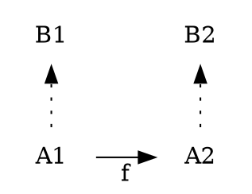

## gdb

* breakpoint - `b basename.cpp:15`
* sources view - `-`
* close source view - `Ctrl-X A`

## git

* branch deletion - local - `git branch -d`
* branch deletion - remote - `git push origin --delete branchname`
* branch rename - local - `git branch -m master master-no-push`
* update to origin - `git merge` - requires `git config --global merge.defaulttoupstream true`; instead of `git pull`

## smali

* [types](https://github.com/JesusFreke/smali/wiki/TypesMethodsAndFields)
* opcode example - `move-object v1, v2  # v1 = v2`
* convert from Java - 

```sh
cat > A.java                               # public class A {} 
javac A.java                               # A.class 
dx --dex --output classes.dex A.class      # classes.dex
java -jar ~/tools/baksmali.jar classes.dex # out/
ls out/                                    # A.smali
```
* disassembler - `dexdump` - `dexdump -d classes.dex > out`
* static analysis toolset - `androguard`

## postgres

* connect - `psql -h localhost -U username dbname`
* `\comminfo`
* `\timing`
* describe anything - `\d` 
* maintenance - `VACUUM FULL VERBOSE;`

## less

* Unhighlight selection - `Alt + u`

## vim

* [search and replace](http://vim.wikia.com/wiki/Search_and_replace)
* search and replace - `:%s/foo/bar/gc`

## bash

* bash - process substitution - `comm -23 <(cut -f1 a.txt) <(cut f1 b.txt)`
* continuous integration - `#!/bin/sh -ex` - verbose and fail early

## linux shell

* `locate` - `updatedb`
* ls - sort by size `ls -S`
* ls - sort by date `ls -t`
* ls - reverse `ls -r`
* sort - in place - `sort file -o file`
* pstree - with PID - `pstree -p`

## linux network

* refresh - `sudo dhclient -r`
* restart - Ubuntu menu : networking : enable, autho ethernet

## linux packages

* __deb__ stands for Debian
* tools - `dpkg`, `apt-get`, `aptitude`, `synaptic`
* list package files - `dpkg-query -L $package_name`
* search package - `dpkg -S <file_name>`

## linux autostart

* `/etc/rc.local`
* [supervisord](http://supervisord.org/) (detailed here)
* monit

## unity

* dir - `/usr/share/applications`, `~/.local/share/applications/`; `jeb.desktop` example:

```
[Desktop Entry]
Encoding=UTF-8
Version=1.0
Type=Application
Name=JEB    
Icon=jeb.png
Path=/home/ilia
Exec=/usr/bin/java -jar /opt/jeb/bin/jeb.jar
StartupNotify=false
StartupWMClass=JEB
OnlyShowIn=Unity;
X-UnityGenerated=true
X-Ayatana-Desktop-Shortcuts=NewWindow

[NewWindow Shortcut Group]
Name=New instance
Exec=/usr/bin/java -jar /opt/jeb/bin/jeb.jar
TargetEnvironment=Unity
```
* another example:

```
[Desktop Entry]
Name=Sublime Text 2
Exec=/opt/Sublime-Text-2/sublime_text
Terminal=false
Type=Application
Icon=sublime_text
StartupNotify=true
Categories=TextEditor;Development;
```
* dir - /usr/share/pixmaps``
* man - `desktop-file-install(1)`
* Windows placement on grid:
 * `Ctrl + Alt + 0-9` (on NumPad)
 * `Ctrl + Win + arrows` - like in Windows OS

## screen

* nice [quick reference](http://aperiodic.net/screen/quick_reference)
* sessions
    - list - `screen -ls`
    - attach - `screen -r [session_name]`
    - detach - `Ctrl-a d`
* screen _tabs_:
    - open  - `Ctrl-a c`
    - move _tab_ 3 - `Ctrl-a 3`
    - move to next - `Ctrl-a Ctrl-a`
* screen buffer scrolling mode - `Ctrl-a [` (then `Page Up`, `Page Down`); hit `Esc` to exit

## python

* guide - http://docs.python-guide.org/en/latest/
* shells - `ipython`, `pypy`, `jupyter`
* `pip install --user --upgrade --ignore-installed`
* template engine - Jinja2
* guide to profiling - [http://www.huyng.com/posts/python-performance-analysis](https://web.archive.org/web/20170628134228/https://www.huyng.com/posts/python-performance-analysis)
* datetime <-> string

```python
from datetime import datetime; from time import ctime
ctime()  # current time - 'Sun Mar 13 12:22:37 2016'
fmt = '%Y-%m-%d %H:%M:%S'
datetime.now().strftime(fmt)
datetime.strptime('2016-01-02 03:04:05', fmt)
```
* relative import externally - **works in pypy only**

```python
import os
os.sys.path.append("..")
__package__ = "ecstatic"
```
* `zip` is it's own opposite

```python
zip([1, 2, 3], [1, 2, 3])  # [(1, 1), (2, 2), (3, 3)]
zip(*[(1, 1), (2, 2), (3, 3)])  # [(1, 2, 3), (1, 2, 3)]
```

* binary <-> int <-> hex

```python
assert int('01011010', 2) == 90
assert '{0:b}'.format(90) == '1011010'

assert int('41', 16) == int('0x41', 0) == 65
assert hex(65) == '0x41'
```

* decorator

```python
import logging
from functools import wraps

def log_done(func):
    @wraps(func)
    def wrapper(*args, **kwargs):
        func(*args, **kwargs)
        logging.warning('%s() - done', func.func_name)
    return wrapper
```

* context manager

```python
from contextlib import contextmanager

@contextmanager
def log_done(job):
    yield
    logging.warning('%s - done', job)

with log_done('rubbish'):
    print 1
```

## apk

* sign

```sh
ALGO="-sigalg SHA1WithRSA -digestalg SHA1"
KEYSTORE="-keystore $HOME/.android/debug.keystore"
jarsigner $ALGO $KEYSTORE "$1" androiddebugkey < <(echo android)
```

## unicode

* U+2191 ↑
* U+2193 ↓
* Linux - `Ctrl + Shift + u` - release - hex digits - `Enter` ('Space' in Sublime)

## jira

* issue fields - `id` can stand for `rank` or `key`
* search for issue - `summary ~ "pypy*" OR description ~ "pypy*"`
* wiki syntax - `{noformat}...lines of text...{noformat}`

## dot

* to image - `dot -Tpng -oout.png data.dot`
* other renderers: `fdp`, `neato`; `man dot`
* example



## funny

* [list](http://www.tecmint.com/20-funny-commands-of-linux-or-linux-is-fun-in-terminal/)
* `fortune`
* Linux is sexy: `who | grep -i blonde | date; cd ~; unzip; touch; strip; finger; mount; gasp; yes; uptime; umount; sleep`

## hadoop

* list - `hdfs fs -ls /path` or `hdfs dfs -ls /path` or `hdfs fs -ls '/path/abc*'`
* [more commands](http://hortonworks.com/hadoop-tutorial/using-commandline-manage-files-hdfs/)

## jetbrain - idea

* open file dialog - auto complete - `Ctrl + Space`
* separate compound names like _CamelCase_ or _any\_thing_ - `CamelHump`

## cyber

* `RAT` - Remote Administration Tool

## image editing

* `ImageMagick` - `convert`, ...
* `Pinta` - MsPaint for Linux
* screenshots

## supervisord

* `/etc/supervisor/conf.d`
* `sudo supervisorctl reread|update|status`

## jeb

* `Tab` to move between assembly and decompiled
* `Shift + Left/Right` to open/close package view

## ssh

* Tunnel: `ssh -f -nNT -L 9000:localhost:5432 user@server`

## sublime

* `Alt + F3` multi-cursor mode on all occurrences (at search)
* `Ctrl + L` select entire line (also in multi-cursor mode)
* `Ctrl + J` join selected lines
* `Ctrl + Shift + u` - release - hex digits - `Space` insert Unicode char
* `Ctrl + m` - jump to matching braket/brace
* `Ctrl + Shift + l` - cursor in every line of selected text

## mount

* `mount <dir>`, `umount`
* `if mountpoint -q <dir>; then echo ok; fi`
* `etc/fstab`
* Filesystems: ext4, ext2, swap, davfs

## docker

* `docker build --file any.dockerfile --tag namespace/project:version .  # dot for context dir`
* `docker run --interactive --tty ubuntu /bin/bash`
* `docker run -p 127.0.0.1:hostport:containerport -v /host/path:/container/path`
* `docker images`
* `docker history imagetag`
* `docker rmi imagetag`
* `docker rm $(docker ps -a -q)`

## matplotlib

```py
import matplotlib.pyplot as plt
plt.plot([0, 3, 1, 2], 'b-')
plt.show()
plt.hist([1] * 5 + [2] * 10 + [3] * 3)
plt.hist(numbers, range=(0, 100))
```

## makefile

* Automatic variables - https://www.gnu.org/software/make/manual/make.html#Automatic-Variables
    - `$@` - rule name, the left part
    - `$*` - stem of the matching, the `%`
    - `$<` - dependencies, the right part

```make
FILES:=$(shell cat filelist.txt)
IMAGES = $(FILES:%=data/%.png)

# do not search for these files
.PHONY: all clean
# do not remove intermediate files
.SECONDARY:

all: archive.zip
archive.zip: $(IMAGES)
    zip -r archive.zip data/
data/%.png:
    convert $*.jpg $@

clean:
    rm -f data/*
```

## rest api

* Postman - development tool
* Fiddler - HTTP traffic analyzer

## aws cli

```sh
# Prepare
pip install --user awscli
aws configure
# Use
aws s3 ls bucket-name
aws s3 ls s3://bucket-name/dir/
aws s3 ls bucket-name/dir/object
aws s3 cp s3://bucket-name/dir/object .  # copy here
aws s3 cp s3://bucket-name/dir/object -  # copy to stdout
```

----

Edit this page [here](https://github.com/barahilia/snippets/edit/gh-pages/_posts/2016-08-03-personal.markdown).
